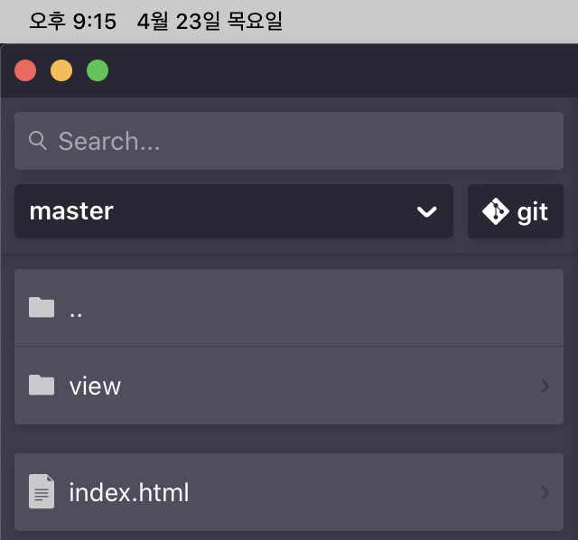

# Tutorial 01. Hello world

## **들어가면서**

프론트 개발을 하신 경험이 있으신 분들이라면, 프론트 엔드 삼대장 리엑트, 앵귤러, 뷰를 들어 보셨을 거라고 생각합니다. 물론, 프론트 엔드 라이브러리나 프레임워크는 다양하게 있지만, 이 3가지가 핫한 이유는 제가 생각하기엔 3가지 정도를 들수 있는 것 같습니다. 먼저, 유지보수하기 쉽고, HTML, CSS, JS 의 기본기가 된 상태라면 구현에 있어서 크게 어려움이 없으면서, 더 나아가 하이브리드 앱이나 PWA와 같은 모바일로도 확장이 가능하죠 \(다른 장점도 수없이 많습니다 ㅎㅎ\) 하지만, 생각보단 자바스크립트 UI 개발 기술 중에선, 괜찮은 친구도 있습니다. 바로, 제가 지금부터 소개드릴 Open-UI5 이지요. 지금부턴 UI5로 기술하겠습니다.

#### 프레임워크와 라이브러리의 차이 

프레임워크와 라이브러리의 차이점을 혹시 아시나요? 간단하게 생각하면 프레임워크는 프레임워크에서 제공하는 공간에 코드를 작성해야하고, 어플리케이션의 흐름을 사용자가 좌지우지 할수 없습니다. 반면, 라이브러리는 그렇지 않죠.  
UI5는 프레임워크에 해당합니다. 뭔가, 프레임워크라고 하니 라이브러리 하나씩 불러올때 마다 눈떵이처럼 커져서 부담스러울 것 같은 느낌이 들 수도 있습니다. \(저도 그랬거든요...\) 또한, 다른 레거시 웹페이지에 붙일 수도 없고, 컴포넌트 단위로 작업을 할수 없을 것 같다...라는 걱정도 있을 수 있습니다. 하지만, UI5는 생각보다 가볍게 쓸수 있고, 레거시 프로그램 간의 연결 또한 가능합니다.

#### Open-UI5와 SAP-UI5 

OpenUI5는 플랫폼 간 응답 성이 뛰어난 엔터프라이즈 급 응용 프로그램을 구축하도록 설계된 JavaScript 응용 프로그램 프레임 워크입니다. Apache 2.0 라이센스에 따라 SAP SE에서 유지 관리하는 오픈 소스 프로젝트이며 기고가 가능합니다. Open-UI5는 사실 세계적인 ERP 회사 SAP에서 제공하는 오픈소스입니다. 그리고 Open-UI5를 기초로 엔터프라이즈용 프레임워크로 SAP-UI5가 있습니다. SAP에서 제공한, 기존의 BSP 기반의 웹 개발에서 벗어나 쉽고 간단하게 사용자가 사용할 수 있는 사용자 경험을 추구하면서 이 기술은 만들어졌습니다.

## Open-UI5 맛보기

뭔가 처음 이 프레임 워크를 설명해서 두서없이 이야기한 감이 있는 부분 양해바랍니다.. 서두만 보면 그래서 이 기술 대단한 건 알겠는데, 어떻게 쓰는건데? 라는 의문이 들 것 같아 본격적으로 Hello World를 찍어보도록 하겠습니다. 

### **개발 환경**

Open-UI5는 웹 UI 프레임워크이기 때문에, 프론트엔드 서버를 띄어줄 정도만 되면 됩니다. 저는 아이패드에서 작업을 진행했는데요, Play.js라는 웹 개발앱을 이용하여 제작했습니다. 이 앱에선 NodeJS기반으로 백엔드를 구성할 수 있어서, 이를 기반으로 프론트엔드 서버를 제작했습니다.   

 **STEP 01. 프론트엔드 서버 제작**

index.js에는 로컬서버를 실행할때, 3000번 포트로 접근하면 index.html로 접근하도록 코드를 작성했습니다. package.json에는 백엔드 서버에 필요한 express 라이브러리를 추가했습니다.

위의 두 설정을 마치면, 서버를 실행하시면 됩니다. 터미널에서 node index.js 명령어를 실행시켜보세요. 정상적으로 서버가 실행되면, 아래와 같이, 3000번 포트로 서버가 실행되었다는 로그를 볼 수 있습니다.

 **STEP 02. index.html 설정**

Step 01에서 간단하게 프론트엔드 서버를 띄우는 방법을 저희는 익혔습니다. 이제 본격적으로 웹페이지를 만들기로 하겠습니다. Open-UI5도 리엑트나 앵귤러와 같이 Single Page Application 기술을 사용합니다. 줄여서 SPA라 불리는 이 기술은 html을 하나만 띄우고 전체적인 화면제어는 자바스크립트 라이브러리가 담당합니다. 그래서 Open-UI5도 index.html을 제외하고 html 파일을 추가하지 않아도 됩니다. 

제가 설정한 WebApp 폴더 구성은 위의 캡처와 같습니다. view 폴더와 index.html 파일 이 두개가 바로 그것입니다. 

먼저, view 폴더를 설정한 이유는 UI5는 MVC 패턴을 이용하여 웹 컴포넌트를 유지합니다. 그중 화면에서 보여지는 부분은 view라고 하는데, UI5로 표현하고 싶은 웹 컴포넌트의 화면 구성 부분을 담은 폴더라고 생각하시면 될 것 같습니다.

반면, index.html에서는  UI5 라이브러리 로드, XML View의 DIV 매핑, 작업을 진행했습니다.

