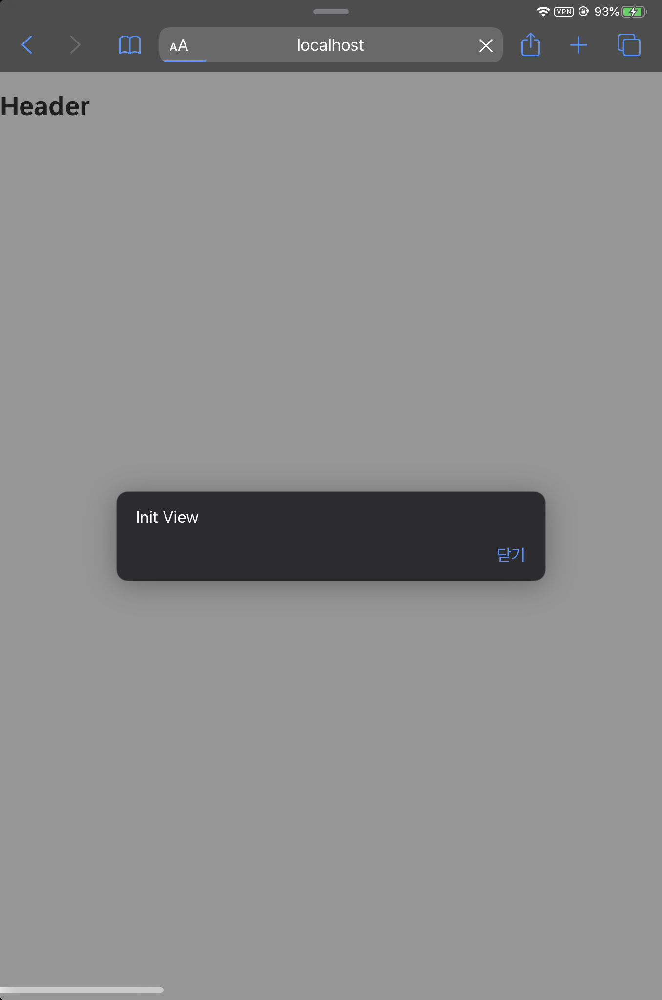
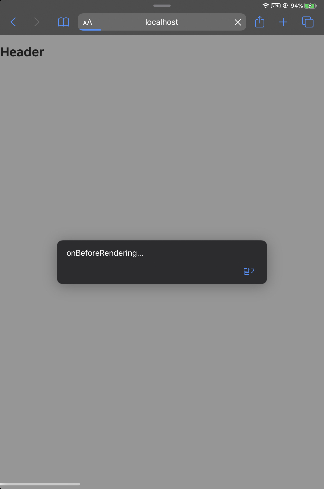
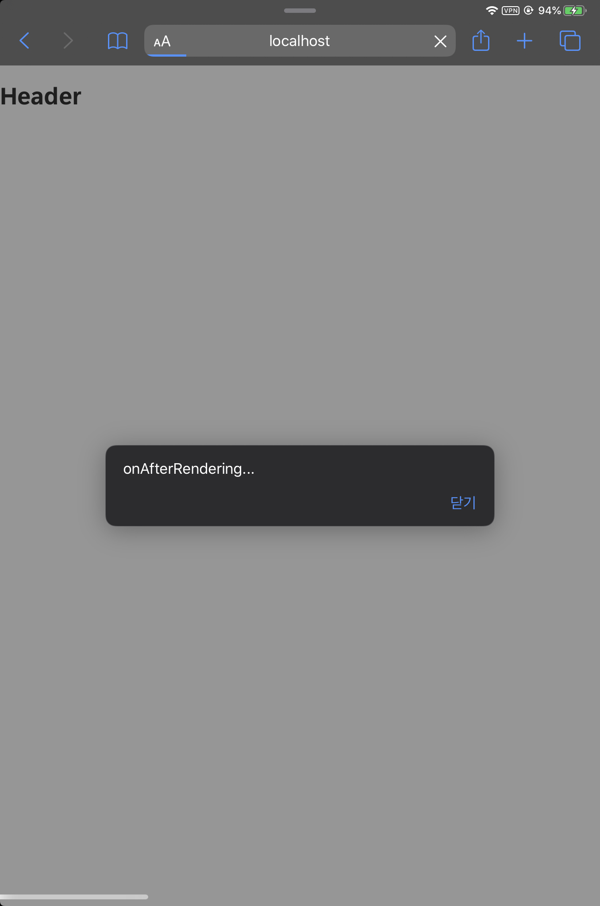
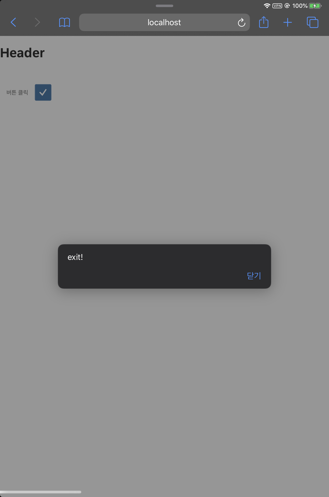
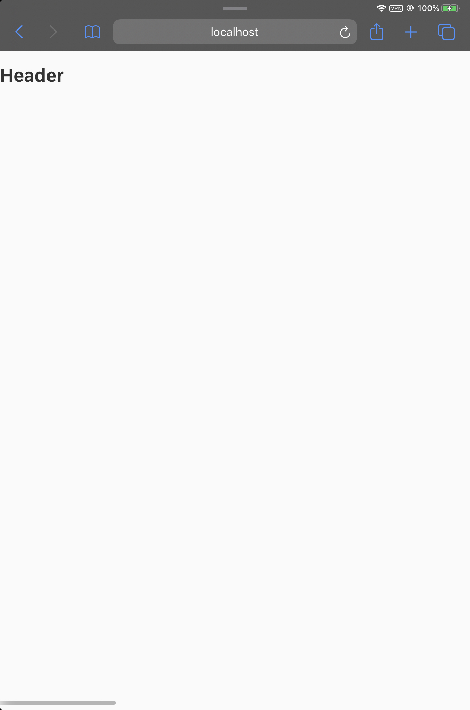

# Tutorial 02. Life Cycle

## 들어가면서

모든 어플리케이션은 생명 주기가 존재합니다. 저는 예전에 유니티라는 게임엔진을 이용해서 게임개발을 했던 경험이 있습니다. 게임을 만들 때 중요하게 생각해야했던 부분 중 하나가 바로 생명주기였습니다. 리소스를 로드하고 보여줘야하는 함수가 있는가 한편, 비동기로 서버와 연락하면서 그때 그때마다 값을 변동해줘야하는 함수도 존재했었지요. 이처럼 모든 프로그램에는 생성에서 소멸에 이르는 전 과정이 있고, 이에 따라 저희 개발자들은 상황에 맞는 로직을 준비해야 합니다. 

### UI5의 생명주기

이 글은 다음[ 링크](https://blogs.sap.com/2018/11/12/sapui5-controller-lifecycle-methods-explained/)에서 참고하여 작성되었습니다.

UI5는 크게 4가지의 생명주기를 지닙니다. onInit, onBeforeRendering, onAfterRendering, onExit이 바로 그것입니다. 지금부터 하나씩 알아보도록 하겠습니다. 


### onInit\(\)

이 메서드는 뷰를 초기화 시킬때 호출됩니다. onBeforeRendering, onAfterRendering과 달리 딱 한번만 호출됩니다. 만약, 뷰를 표시하기 전에 뷰의 매핑 내용을 수정해야하는 경우엔 이 메서드에서 수정할수 있습니다. F5 새로고침을 할때마다 함수 실행 가능합니다.

### onBeforeRendering\(\)

이 메서드는 뷰가 렌더링 될 때마다 호출됩니다. DOM Tree에 HTML 코드가 배치되기 전, 즉 화면 렌더링이 되기 전에 호출되는 메서드입니다. 다시 렌더링하기 전에 정리작업을 수행하는데 사용할 수 있습니다.

### onAfterRendering\(\)

이 메소드는 HTML이 DOM Tree에 배치 된 후 View가 렌더링 될 때마다 호출됩니다. 화면 렌더링이 완료된 후 DOM에 추가 변경 사항을 적용하는 데 사용할 수 있습니다.

### onExit\(\)

이 메소드는 뷰가 삭제되면 호출됩니다. 컨트롤러에서 뷰가 소멸시, 해당 메서드가 자동으로 호출됩니다. 또한, onBeforeRendering 및 onAfterRendering와 달리 View 인스턴스 당 한 번만 호출됩니다. \(또한, onInit\(\)처럼  새로고침을 할때마다 실행이 되지 않습니다.\)


### onBeforeRendering과 onInit의 차이

onBeforeRendering 함수는 뷰가 로드하기전에 개발자가 실행하고자 하는 코드를 실행하는 메서드입니다. 흔히 API나 Odata 통신을 이용해서 얻은 결과값을 Model에 매핑을 시킬때 많이 사용됩니다.

반면 onInit에서 onBeforeRendering에서 Model에 데이터를 매핑하는 것도 가능합니다. 또한, 뷰가 호출될때 한번만 호출되어 주로 뷰의 초기 설정 값을 로드 할 때 사용됩니다. 하지만, onInit에서 oData를 매핑하는 경우엔, 사용자는 실시간으로 자신이 바꾸는 데이터를 눈으로 확인하기 어려울 것입니다. onBeforeRendering은 매번 뷰가 렌더링될때마다 실행되니, 그때마다 바뀐 데이터를 실시간으로 받아올 수 있지요. 

## 사용예시

실제로 화면에서 해당 메서드가 어떻게 호출되는지 캡처화면을 보시면 이해가 빠를 것입니다.

### onInit\(\)



### onBeforeRendering\(\)



### onAfterRendering\(\)



### onExit\(\)





## 사용코드

&lt;index.html&gt;

```markup
<!DOCTYPE html>
<html>
  <head>
    <title>OpenUI5 Hello world App</title>
   <script id = "sap-ui-bootstrap"
            src="https://openui5.hana.ondemand.com/resources/sap-ui-core.js"
            data-sap-ui-theme="sap_belize"
            data-sap-ui-libs="sap.m"
            id="sap.ui-bootstrap"
            data-sap-ui-resourceroots='{"view" : "./"}'
            data-sap-ui-xx-bindingsyntax="complex"
            >
  </script>
 <script>
   sap.ui.localResources("view");
   
    sap.ui.getCore().attachInit(function(){
      
        var page = new sap.ui.view({
        id : "idMain",
        viewName : "view.main",
        type: sap.ui.core.mvc.ViewType.XML
       }).placeAt("content");
    
    });
     </script>
 
  </head>
<body class="sapUiBody">
  <h1>Header</h1>
  <div id="content"></div>  
</body>
</html>
```

&lt;main.controller.js&gt;

```javascript
sap.ui.define([
  "sap/ui/core/mvc/Controller",
    
],function(Controller){
    "use strict"
    return Controller.extend("view.main",{
      onInit : function(){
        alert("Init View")
      },
      onBeforeRendering : function(){
        alert("onBeforeRendering...")
      },
      onAfterRendering : function(){
        alert("onAfterRendering...")
      },
      onExit : function(){
        alert("exit!")
      },
      
      onClicked : function(Event){
        this.getView().destroy();
      }
    });
});

```


