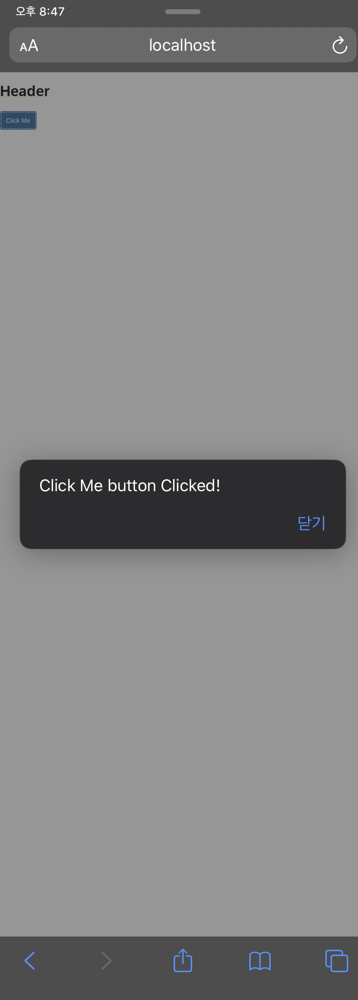

# Tutorial 03. UI5 Views

### 들어가면서

이번 글은  [링크](https://blogs.sap.com/2018/02/09/sapui5-views/) 를 참고하여 제작되었습니다. UI5는 MVC 패턴을 사용하여 화면을 제어합니다. 그 중에 View는 UI\(User Interface\)와 직접적인 연관이 있는 만큼 굉장히 중요한 부분을 차지합니다. UI5에서는 기본적으로 버튼이나 입력 필드, 테이블, 리스트 등과 같은 스크린 요소들을 제공합니다. 더불어, 레이아웃과 관련된 HBox, VBox Flex Box 등의 요소들도 제공하지요. UI5는 크게 4가지 타입의 View를 제공합니다. 

## UI5 View Type

* JS View
* XML View
* HTML View
* JSON View

이중 JS View와 XML View는 광범휘하게 사용되고 있고, SAP에서 제공하는 Hybrid 앱 플랫폼인 Fiori에선 XML View가 대부분 사용되고 있습니다. 추가로 개발자가 Custom View를 만들 수 있는데, 이는 sap.ui.core.mvc.View 라이브러리를 상속하면 가능합니다.

### JS View Example

#### Main.controller.js

```javascript
sap.ui.define([
  "sap/ui/core/mvc/Controller",    
],function(Controller){
    "use strict"
    return Controller.extend("view.Main",{
      onClicked : function(Event){
        alert("Click Me button Clicked!");
      }
    });
});
```

####  Main.view.js

```javascript
sap.ui.jsview("view.Main",{
 getControllerName : function(){
    return "view.Main"
 },
 createContent : function(oController){
   
   alert(oController.onClicked);
   var oButton = new sap.m.Button(
     this.createId("helloButton"),{
       text : "Click Me"
     });
     
   oButton.attachPress(oController.onClicked);
 
 var oPage = new sap.m.VBox({
   });
   
   oPage.addItem(oButton);
   
   return oPage;
 }
});  
```

#### Index.html

```markup
<!DOCTYPE html>
<html>
  <head>
    <title>OpenUI5 Hello world App</title>
    <script id = "sap-ui-bootstrap"
            src="https://openui5.hana.ondemand.com/resources/sap-ui-core.js"
            data-sap-ui-theme="sap_belize"
            data-sap-ui-libs="sap.m"
            id="sap.ui-bootstrap"
            data-sap-ui-resourceroots='{"view" : "./"}'
            data-sap-ui-xx-bindingsyntax="complex"
            >
     </script>
     <script>
     sap.ui.localResources("view");
 
     var app = new sap.m.App({ initialPage : "idMain"});
     
     var view = sap.ui.view({
        id : "idMain",
        viewName : "view.Main",
        type: sap.ui.core.mvc.ViewType.JS
     });
     
     app.addPage(view);
     app.placeAt("content");
     
     </script>
  
  </head>
<body class="sapUiBody" role="application">
  <h1>Header</h1>
  <div id="content"></div>
</body>
```

### XML View Example

#### Main.view.xml

```markup
<mvc:View 
    controllerName="view.Main"
    xmlns="sap.m"
    xmlns:mvc="sap.ui.core.mvc">
    <VBox>
      <Button text="Click Me" press="onClicked"/>
    </VBox>

```

## Result 




