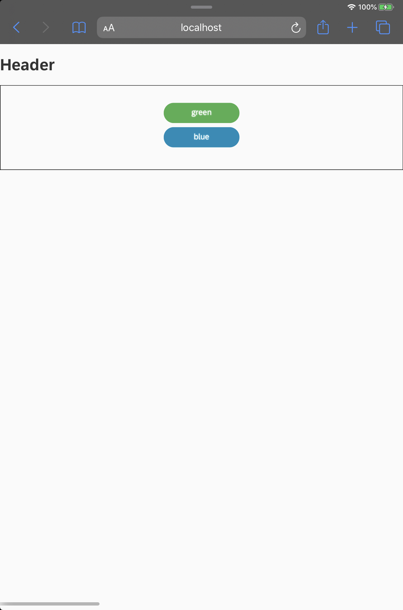

# Tutorial 04. Using HTML native Tag & Custom CSS

## 들어가면서

UI5를 보시면 기존에 웹을 공부하신분들이라면, 뷰 화면을 구성할때 태그가 html 표준 코드와는 다른 점을 알 수 있습니다. 사실 이는 UI5에서 표준으로 제공하는 일종의 부트스트랩 스타일이 포함된 뷰 요소를 제공하기 때문입니다. UI5에서제공하는 Label이나 Button 태그를 살펴보면 UI5 자체적으로 제공하는 css 스타일 룰을 따릅니다. 아무래도 UI5의 목적자체가 Fiori에서 통일된 UI를 사용자에게 제공하기 위한 부분도 있어서 그렇지 않나 생각을 해볼 수 있을 것 같습니다.

그렇다면 정녕 저희는 HTML을 그대로 사용할수 없는 것일까요? 또한, CSS도 서비스의 특징에 따라 달라져야하는데, 이부분도 안되는 걸까요? 사실은 그렇지 않습니다. UI5는 html5 표준을 따르는 라이브러리이기 때문에 이에 대한 해결책을 제공합니다.

## How to

### Native HTML 태그 사용 방법

Native HTML은 UI5에서 View단의 코드에서 작성할 수 있습니다. 바로 아래의 구문을 사용하면 됩니다. UI5는 View 라이브러리로 제공하는 요소들을 _**`xmlns:"변수"="라이브러리 경로"`**_의 형태로 불러올 수 있습니다. 

```markup
xmlns:html="http://www.w3.org/1999/xhtml"
```

### Custom CSS 태그 사용방법

여기에서 흥미로운 점이 있는데, XML View 안에서 직접 CSS 스타일을 구현할 수 있습니다.  이와 같은 방법을 사용하면 XML View에 따라 Custom CSS 스타일을 관리할 수 있는 장점이 있습니다. 다른 방법으로는, index.html에 CSS파일을 로드하는 방식이 있습니다.

UI5의 View 요소들은 default CSS Style이 들어가 있습니다. 이로 인하여, 기존 CSS 스타일을 사용했을때, 적용이 안되는 애로사항이 존재합니다. 이를 해결하기 위해선 Custom CSS 스타일\(ex .btnStyleBlue\)를 특정 View Element CSS 스타일\(.sapMBtnInner\)에 상속하는 방법이 있습니다. 


```markup
<link rel="stylesheet" href="css/style.css">
```



```markup
<html:style>
      .btnStyleBlue .sapMBtnInner{
         border-radius:30px;
         background-color: #008CBA; /* Blue */
         border: none;
         color: white;
         width : 150px;
         text-align: center;
         text-decoration: none;
         display: inline-block;
         font-size: 16px;
      } 
 </html:style>
```



```markup
<mvc:View 
    controllerName="view.Main"
    xmlns:html="http://www.w3.org/1999/xhtml"
    xmlns="sap.m"
    xmlns:f="sap.ui.layout.form"
    xmlns:mvc="sap.ui.core.mvc">
    
    <html:style>
      .btnStyleBlue .sapMBtnInner{
         border-radius:30px;
         background-color: #008CBA; /* Blue */
         border: none;
         color: white;
         width : 150px;
         text-align: center;
         text-decoration: none;
         display: inline-block;
         font-size: 16px;
      } 
    </html:style>
   
   <f:SimpleForm class="newForm">
       <VBox>
         <Button id="btn1" class="btnStyleGreen" text="green" press="onClicked" />
         <Button id="btn2" text="blue" press="onClicked" />
        </VBox>
    </f:SimpleForm>
     
</mvc:View>
```



```javascript
sap.ui.define([
  "sap/ui/core/mvc/Controller",    
],function(Controller){
    "use strict"
    return Controller.extend("view.Main",{

      onAfterRendering : function(){
         var btn1 = this.getView().byId("btn2");
         btn1.addStyleClass('btnStyleBlue');
      },
      onClicked : function(Event){
        alert("button Clicked!");
      }
    });
});

```



```markup
<!DOCTYPE html>
<html>
<head>
  <title>OpenUI5 Hello world App</title>
  <script id = "sap-ui-bootstrap"
          src="https://openui5.hana.ondemand.com/resources/sap-ui-core.js"
          data-sap-ui-theme="sap_belize"
          data-sap-ui-libs="sap.m"
          id="sap.ui-bootstrap"
          data-sap-ui-resourceroots='{"view" : "./"}'
          data-sap-ui-xx-bindingsyntax="complex"
          >
   </script>
   <link rel="stylesheet" href="css/style.css">
   <script>
   sap.ui.localResources("view");
 
   var app = new sap.m.App({ initialPage : "idMain"});
   
   var view = sap.ui.view({
      id : "idMain",
      viewName : "view.Main",
      type: sap.ui.core.mvc.ViewType.XML
   });
   
   app.addPage(view);
   app.placeAt("content");
   
   </script>

</head>
<body class="sapUiBody" role="application">
<h1>Header</h1>
<div id="content"></div>
</body>
</html>
```


## 실행화면




