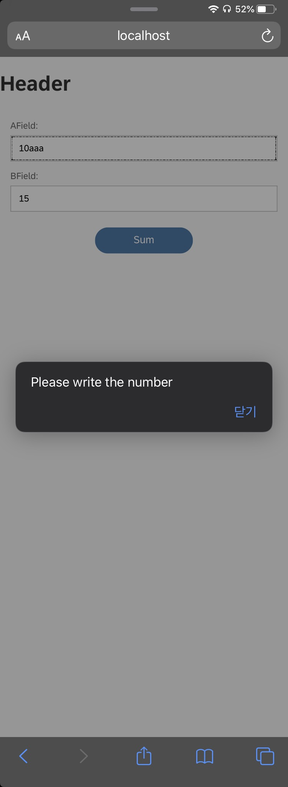

# Tutorial 05. Module

## 들어가면서

자바스크립트 프로그램은 꽤 작게 시작되었습니다. 초기에 사용된 대부분의 스크립트는 독립적인 작업을 수행하며, 일반적으로 큰 스크립트가 필요하지 않았습니다. 요즘 모던 자바스크립트에선 브라우저 제어로직이나 Node.js와 같은 브라우저 외의 영역에서도 사용가능합니다.

따라서 자바스크립트는 필요에 따라 라이브러리를 가져오고, 이를 별도의 모듈로 분할하기 위한 매커니즘을 도입합니다. node.js가 그 예시이지요.

## UI5 모듈 제어

SAPUI5 프레임워크는 모듈화되고 이해하기 쉬운 자바스크립트 어플리케이션을 지원하기 위해 설계되었습니다. 이는해당 기능이 필요로 될때 즉시 로딩될 수 있도록, 더 작은 기능 단위로 기능 분화를 가능하게 합니다.

저희는 이전에 UI5 Controller.js에서 sap.ui.define이라는 구문을 사용하고 안에 해당 의존성을 불러오는 작업을 진행했습니다

아래 소스를 보시면 sap/ui/core/mvc/Controller경로에 있는 Controller.js 라이브러리를 불러온 후, 이에 대한 메모리를 할당하는 과정을 볼 수 있습니다.

```javascript
sap.ui.define([
  "sap/ui/core/mvc/Controller",    
],function(Controller){
    "use strict"
    return Controller.extend("view.Main",{

      onAfterRendering : function(){
         var btn1 = this.getView().byId("btn2");
         btn1.addStyleClass('btnStyleBlue');
      },
      onClicked : function(Event){
        alert("button Clicked!");
      }
    });
});

```

## 간단한 계산기 만들기

지금부터 간단한 모듈을 만드는 작업을 진행할 것입니다. 바로 사칙연산을 제공하는 계산기 모듈입니다. Controller.js에서 같은 root resource 안에 있는 계산기 모듈에 접근하여 사칙연산 결과값을 alert로 뿌려주는 작업을 진행할 것입니다.

### Step 1. 디렉토리 구성

```javascript
webApp/
   ㄴ Main.controller.js
   ㄴ Calculator.js
   ㄴ Main.view.xml
```

디렉토리 구성은 다음과 같습니다. 화면단을 제어하는 Main.controller.js 파일 외에 Calculator.js 파일을 만듭니다. Calculator.js는 더하기, 빼기, 곱하기, 나누기의 4가지 기능을 제공합니다. main.view.xml에서는 2개의 text input field를 추가하여 사용자의 입력을 받고, Sum 버튼을 클릭하면 2개의 text input field에서 받은 값을 Number 형태로 변환하여 사칙연산을 진행할 예정입니다.

### Step 2. 소스 구성


```markup
<mvc:View 
    controllerName="view.Main"
    xmlns:html="http://www.w3.org/1999/xhtml"
    xmlns="sap.m"
    xmlns:f="sap.ui.layout.form"
    xmlns:mvc="sap.ui.core.mvc">
    
    <html:style>
      .btnStyleBlue .sapMBtnInner{
         border-radius:30px;
         background-color: #008CBA; /* Blue */
         border: none;
         color: white;
         width : 150px;
         text-align: center;
         text-decoration: none;
         display: inline-block;
         font-size: 16px;
      }
      .hBoxStyle{
        text-align: center;
      }
    </html:style>
   
   <f:SimpleForm editable="true" layout="ResponsiveGridLayout">
      <f:content>
           <Label text="AField" labelFor="AFieldInput"/>
           <Input type="Text" id="AFieldInput"/>
           <Label text="BField" labelFor="BFieldInput"/>
           <Input type="Text" id="BFieldInput"/>           
      </f:content>
    </f:SimpleForm>
    <VBox class="hBoxStyle">
      <Button id="btn2" class="btnStyleGreen" text="Sum" press="onSum" />
     </VBox>
</mvc:View>
```


UI5는 SimpleForm이라는 간단한 폼 형식의 UI element를 제공합니다. 이는 Form에 사용되는 여러 UI element들을 화면 크기에 맞춰서 정렬해주는 역할을 합니다.


```javascript
sap.ui.define([],function(){
   "use strict"
    return {
      onSum : function(a,b){
        return a+b;
      },
      onSub : function(a,b){
        return a-b;
      },
      onMultiply : function(a,b){
        return a*b;
      },
      onDivide : function(a,b){
        return a/b;
      }
    } 
  });
```



```javascript
sap.ui.define([
  "sap/ui/core/mvc/Controller",
  "view/Calculator"    
],function(Controller,Calculator){
    "use strict"
    return Controller.extend("view.Main",{     
      onAfterRendering : function(){
         var btn1 = this.getView().byId("btn2");
         btn1.addStyleClass('btnStyleBlue');
      },
      onSum : function(){
        var aFieldValue = sap.ui.getCore().byId(this.createId("AFieldInput")).getValue();
        var bFieldValue = sap.ui.getCore().byId(this.createId("BFieldInput")).getValue();                        
        
        var reg = new RegExp('^[0-9]+$');
        
        if(!reg.test(aFieldValue) || !reg.test(bFieldValue)){
          alert("Please write the number");
          return;
        }
        
        aFieldValue = parseInt(aFieldValue);
        bFieldValue = parseInt(bFieldValue);
        
        
        alert(Calculator.onSum(aFieldValue,bFieldValue));
      }
    });
});

```


UI5에서 외부 모듈을 가져오는 방법은 sap.ui.define에 앞서 제작한 라이브러리의 경로를 작성하고, 해당 라이브러리를 정의해 주어야합니다. **“function\(Controller, Calculator\)”** 가 바로 그 예시입니다.  이 방법을 통해 저희는 더 작은 기능 단위로 함수를 더 나눌수 있습니다.

### Step 3. 결과화면




## sap.ui.define과 sap.ui.require의 차이점

본 글은 이 [링크](https://dingyj.gitbook.io/blog/sap/untitled/sapui5-sap.ui.define-and-sap.ui.require)를 참고했습니다. UI5에서 module을 로드하는 방법으로 2가지 방법이 있습니다. sap.ui.define은 Global namespace 모듈로 정의하고 의존적인 모듈을 가져옵니다. 반면, sap.ui.require는 namespace선언 없이 의존적인 모듈을가져옵니다. 

저희가 sap.ui.define을 통해 view controller를 만들면, 내부적으로는 sap.ui.require를 이용하여 view controller를 로드하고, 이를 view단으로 적용되는 프로세스가 진행됩니다.

앞서 제작했던 Calculator.js를 require를 사용한다면 이렇게 바꿀 수 있습니다.


```javascript
sap.ui.define([
  "sap/ui/core/mvc/Controller"
],function(Controller){
    "use strict"
    return Controller.extend("view.Main",{     
      onAfterRendering : function(){
         var btn = this.getView().byId("btn2");
         btn.addStyleClass('btnStyleBlue');
      },
      onSum : function(){
        var aFieldValue = sap.ui.getCore().byId(this.createId("AFieldInput")).getValue();
        var bFieldValue = sap.ui.getCore().byId(this.createId("BFieldInput")).getValue();                        
        
        var reg = new RegExp('^[0-9]+$');
        
        if(!reg.test(aFieldValue) || !reg.test(bFieldValue)){
          alert("Please write the number");
          return;
        }
        
        aFieldValue = parseInt(aFieldValue);
        bFieldValue = parseInt(bFieldValue);
       
        sap.ui.require(["view/Calculator"], function(Calculator){
            alert(Calculator.onSum(aFieldValue,bFieldValue)); 
        });
        
      }
    });
});

```


ㅇ아앞


