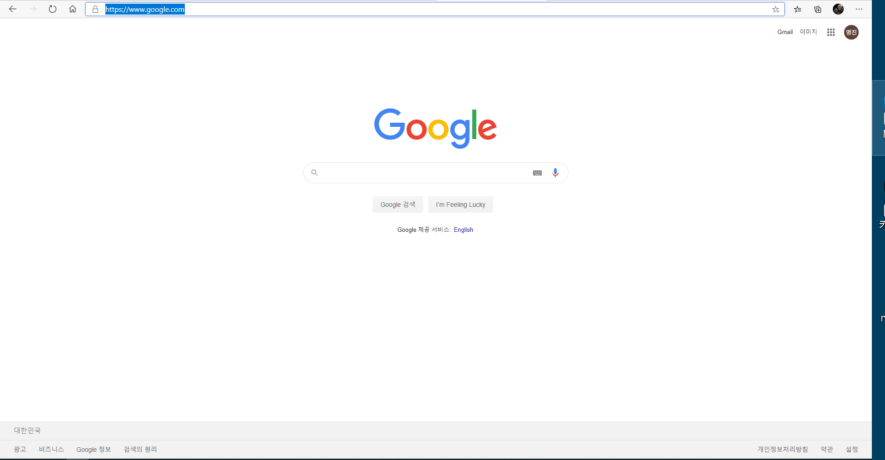

# Tutorial 06. Using OData

## 들어가면서

Odata는 UI5에서 데이터 부분을 다루는데 있어서 가장 중요한 부분입니다. 주로 Fiori단에서 웹 개발을 한다면, Odata는 절대적일 정도로 매우 많이 사용되는 프로토콜입니다. 일단 가볍게 Odata란 무엇인지 알아보겠습니다. [위키백과](https://en.wikipedia.org/wiki/Open_Data_Protocol) 에서 Odata의 정의를 찾아보면 이렇습니다.

## Odata의 정의

 단순하고 표준적인 방식으로 쿼리를 쓸수 있고, Restful API를 생성하고 사용할 수 있는 개방형 프로토콜. Odata는 데이터를 주고받는데 있어서 필요한 일종의 규약 중 하나입니다. SAP 외에도 .Net에도 Odata는 사용될 만큼 널리 사용되는 프로토콜 양식 중 하나입니다. 이 기술은 HTTP, ATOM/XML, JSON을 기반으로 만들어졌습니다. 그리고 다른 REST 기반 웹 서비스보다 유연하며 데이터 소스, 애플리케이션, 서비스 및 클라이언트 간의 쉬운 상호 운용성을 위해 데이터 및 데이터 모델을 설명하는 균일한 방법을 제공합니다.

## Odata를 왜 쓰는가?

이번 설명은 이 [링크](https://www.progress.com/blogs/what-is-odata-rest-easy-with-our-quick-guide)를 참고했습니다.

웹 브라우저와 모바일 앱과 같은 다양한 서비스는 방대한 양의 데이터를 사용합니다. 그리고 이를 구성하는 코드 역시 제각각이지요. Odata의 역할은 서로 다른 모든 소스에서 상호 연결된 데이터 에코시스템을 가져와 기존 웹 표준을 기반으로 단순하고 뛰어난 데이터 연결은 가능하게 하기 위함입니다. 이러한 표준을 통해 사용자 지정 응용 프로그램, 클라우드 스토리지, 컨텐츠 관리에 이르기까지 보다 더 좋은 효율성이 향상되지요.

Odata의 가장 큰 장점은 기본적으로 표준화된 REST 인터페이스를 사용하는 것입니다. 따라서 Android, iOS, 다른 비즈니스 웹 서비스 들과 인터페이스 할 때, RESTful 인터페이스를 사용할 수 있습니다. 즉, 호환성이 높다라는 것이지요.

### 기존 SAP 시스템의 통신방법  

