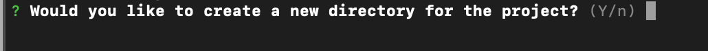

# Tutorial 08. Routing

## 들어가면서 

UI5는 웹페이지 간의 Navigation 기능을 제공합니다. 이것이 바로 Routing입니다. Tutorial 01을 보신 분이라면 UI5가 SPA\(Single Page Application\)이라는 것을 알고 계실 것입니다. SPA의 특징은 바로 화면을 구성하는 html 파일이 index.html 파일 하나밖에 없다는 것이 특징입니다. 

## SPA 브라우저 Routing 원리 

예를 들어, 구글 페이지를 SPA로 구현을 한다고 가정을 해보겠습니다.  구글을 구성하는 여러 페이지 중에서 가장 먼저 보여지는 Main 페이지는 바로 [https://www.google.com/](https://www.google.com/) 의 도메인에 매핑된 구글 검색 창입니다. 


이 메인 페이지에서 저희는 구글 검색창에 UI5라는 검색어를 친다고 가정을 할게요, 저희는 아래와 같은 화면을 볼 수 있습니다. 여기에서 가장 중요한 것은 바로 브라우저 주소창의 주소 값입니다. SPA는 JSP나 PHP 등과 같이 개발된 MPA\(Multi Page Application\)과 다르게, html 파일이 하나 밖에 없기 때문에 페이지를 구분하는데 있어서, 브라우저 주소창의 값을 기준으로 페이지를 렌더링 합니다. 이 방식은 UI5도 동일하지요. 


## 간단한 브라우저 라우팅 예제

UI5에서 라우팅을 하는 방법은 여러가지가 있습니다. 라우터 객체를 이용하는 방법과 sap.m.App 객체를 이용하는 방법인데요, 먼저 sap.m.App 객체를 이용하는 방법에 대해서 알아보겠습니다.

sap.m.App 객체를 이용하는 방법은 각 페이지를 구성하는 JS View를 만들고 이를 App 객체에 추가하여 화면에 표시하는 방법입니다. 아래 소스는 index.html에 sap.m.App 객체를 선언하고 initalPage를 설정하여 초기 페이지 설정을 한 것입니다. Go to Second Page라는 버튼을 누르면 Page2로 화면이 전환되고, Page2에서 네비게이션 바 왼쪽 상단의 뒤로가기 버튼을 누르면, 첫번째 페이지로 되돌아갑니다. 

```markup
<!DOCTYPE html>
<html>
  <head>
    <title>OpenUI5 Hello world App</title>
    <script id = "sap-ui-bootstrap"
            src="https://openui5.hana.ondemand.com/resources/sap-ui-core.js"
            data-sap-ui-theme="sap_belize"
            data-sap-ui-libs="sap.m"
            id="sap.ui-bootstrap"
            data-sap-ui-resourceroots='{"views" : "./"}'
            data-sap-ui-xx-bindingsyntax="complex"
            >
     </script>
     <script>
      sap.ui.getCore().attachInit(function(){
        var app = new sap.m.App("myApp",{
          initalPage : "page1"
        });

        var page1 = new sap.m.Page("page1",{
          title : "first page",
          showNavButton : false,
          content : new sap.m.Button({
            text : "Go to Second Page",
            press : function(){
              app.to("page2")
            }
          })
        });

        var page2 = new sap.m.Page("page2",{
          title : "second page",
          showNavButton : true,
          navButtonPress : function(){
            app.back();
          }
        });


        app.addPage(page1);
        app.addPage(page2);
        app.placeAt("content");
      });
     </script>
  
  </head>
<body class="sapUiBody">
  <div id="content"></div>
</body>
</html>
```

### 결과화면 


위의 방법으로도 사실 많은 것을 개발할 수 있습니다. 하지만, Fiori나 UI5를 이용하는 많은 프로젝트는 manifest.json 파일에 각 view 화면의 정보를 매핑하여 라우팅 기능을 제공합니다. 

manifest.json을 쉽게 이용하기 위해서 이제부터는 generator-easy-ui5이라는 ui5 프로젝트 generator를 사용하겠습니다. \(이클립스에 ADT를 사용하셔도 무방합니다.\)

## generator-easy-ui5 설정

generator-easy-ui5는 OpenUI5 프로젝트를 빠르고 효과적으로 만들 수 있는 generator입니다. 리엑트로 치면 create-react-app과 비슷한 것으로 생각하셔도 되겠네요. 이 라이브러리는 SAP에서 Open-UI5 프로젝트 세팅을 도와주기 위해 만든 것입니다. 


이제 본격적으로 설치 작업을 시작하겠습니다. generator-easy-ui5는 NPM으로 설치가 가능합니다. Nodejs를 먼저 설치해 주신 후,  CLI 창에 `npm i -g yo generator-easy-ui5` 명령어를 쳐주세요.  그리고 yoeman 라이브러리 설치를 하시겠습니까라는 메시지가 나오면 Y를 눌러주시면 됩니다. \(nodejs 10버젼 이상에서 라이브러리가 설치되므로, 참고바랍니다.\)

### easy-ui5 사용방법

easy-ui5를 사용하는 방법은 매우 간단합니다. 커멘드라인데 yo라고 쳐주세요.


Yo 명령어를 치면 아래와 같이 5가지 옵션이 제공됩니다. 첫번째 라인은 easy-ui5 를 실행하는 것이고, 두번째는 업데이트, 세번째는 다운로드 등등으로 구성되어 있네요. Easy Ui5를 그대로 실행하면 됩니다. 엔터를 눌러주세요


엔터키를 누르시면 어떤 플랫폼을 대상으로 개발을 할 것인지 옵션이 제공됩니다. 저희는 첫번째 옵션인 Static webserver 를 실행할 것 입니다. 


다음으로 어떤 라이브러리를 로드 할 것인지를 선택하는 창입니다. 저희는 그동안 CDN\(Content Delivery Network\)를 사용하여 UI5 프레임워크 라이브러리를 구동했습니다. 하지만, 이는 인터넷의 연결이 필요하고, 라이브러리를 서버에서 가져오는 과정과 부트스트랩 과정에서 많은 시간이 소요됩니다. 3번째 옵션인 Local resource \(OpenUI5\)를 선택하겠습니다.



다음으로 새로운 프로젝트 디렉토리를 생성할 것인지 여부를 선택하는 창입니다. 저는 Y를 선택했습니다.


다음으론 추가적인 세팅에 관한 것들입니다. 먼저, 프로젝트 명을 설정하고, 네임스페이스를 설정한 후 어떤 형식의 view타입을 main.view.xml로 설정을 할 것인지 그리고 main.view.xml의 이름은 어떻게 설정할 것인지에 관한 내용입니다. 저는 위의 사진처럼 선택했습니다.


설정을 모두 완료하시면 위의 같은 파일을 보실수 있습니다. webapp은 UI5 default 디렉토리 설정이고, lint, package.json 등등이 있습니다. karma는 UI 테스트 개발에 사용되는 라이브러리입니다.


우선 먼저, 서버를 시동시켜보기 위해 package.json 파일을 살펴보겠습니다. easy-ui5는 다음과 같은 서버 실행 옵션을 제공합니다. 저희는 서버를 구동시켜야하기 때문에, npm run start 혹은 npm start를 커멘드라인에서 실행시키시면 됩니다.  


## Step 01. manifest.json

이제 서버를 구동하는 방법을 알았으니, 본격적으로 라우팅 설정에 대해서 알아보겠습니다. 

```javascript
  "routing": {
      "config": {
        "routerClass": "sap.m.routing.Router",
        "viewType": "XML",
        "viewPath": "com.myorg.ui5Router.view",
        "controlId": "idAppControl",
        "controlAggregation": "pages",
        "async": true
      },
      "routes": [
        {
          "name": "mainView",
          "pattern": "",
          "target":  "mainView"
        },
        {
          "name" : "secondPage",
          "pattern" : "subView",
          "target" : "secondView"
        }
      ],
      "targets": {
        "mainView": {
          "viewType": "XML",
          "viewLevel": 1,
          "viewName": "MainView"
        },
        "secondView" :{
          "viewType" : "XML",
          "viewLevel" : 1,
          "viewName" : "SecondView"
        }
      }
    }
```

UI5는 라우팅 정보를 manifest.json 파일에 저장합니다. 먼저 config 설정에서 라우팅 관련 정보를 입력되어 있는 것을 볼 수 있습니다. 그리고 routes 배열은 화면의 url 패턴과 타겟 정보를 의미합니다. 반면, 타겟 배열에는 각 View에 해당하는 타겟명을 설정되어 있습니다. 

라우팅을 설정할 땐, 우선 targets에 현재 웹앱에서 라우팅이 필요한 페이지 정보를 선언해야합니다. 

```javascript
"targets" : {
    "페이지 타겟 명" : {
        "viewType" : "JSON XML ..."
        "viewLevel" : "1 2 ...."
        "viewName" : "view 이름"
    }
}
```

 이중  viewLevel은 화면을 라우팅하면서 스와핑 애니메이션을 어떻게 할 것인지 설정하는 것을 의미합니다.

라우팅 관련해선 다음과 같이 표현하면 됩니다. routes라는 json 배열에 아래와 같이 선언하면 됩니다.

```javascript
"routes" : [
     {
          "name": "navTo 함수를 호출할때 부를 페이지 명" ,
          "pattern": "url 패턴 명/ 보통 메인 화면은 공백으로 표현",
          "target":  "연결하고자 하는 타겟명"
     }
]
```

## Step 02. 디렉토리 구성 


저희는 앞선 manifest.json 설정에서 MainView와 SecondView를 라우팅에 사용할 것으로 설정했습니다. ui5에서 다른 웹 페이지로 이동하기 위해선, 현재 view 페이지의 라우터 정보를 알아야합니다. 이를 위해 아래와 같은 구문을 사용하면, 현재 페이지의 라우터 위치를 알수 있습니다. 또 페이지간 이동을 위해선, navTo\("이동할 페이지 라우트 명"\)으로 소스를 작성해주시면 됩니다.

이 설명은 [이글](https://www.reimaginer.me/entry/spa-and-spa-routing)을 참고했습니다. SecondView.controller.js를 보시면, 브라우저 히스토리에 있는 이전 페이지로 이동하는 과정을 보실 수 있습니다. 기존의 웹 사이트에선 링크\(앵커 &lt;a href="\#"&gt;\)를 사용하여 페이지간 이동을 했었습니다. 앵커에 명시된 자원을 서버에 요청하고 응답받은 페이지를 브라우저에 표현하는 것입니다. SPA는 location.hash와 history API를 통해 웹 페이지간 논리적인 분리를 진행합니다. SecondView.controller.js에선 history API에 이전 페이지가 있는 겨우 이전 페이지로 이동하고, 없는 경우엔 메인 페이지로 이동하도록 코드를 작성했습니다. 


```javascript
sap.ui.define([
  "com/myorg/ui5Router/controller/BaseController"
], function(Controller) {
  "use strict";

  return Controller.extend("com.myorg.ui5Router.controller.MainView", {
    navToSecondPage : function(){
      var oRouter = sap.ui.core.UIComponent.getRouterFor(this);
      oRouter.navTo("secondPage");
    }
  });
});

```



```javascript
sap.ui.define([
    "com/myorg/ui5Router/controller/BaseController",
    "sap/ui/core/routing/History"
  ], function(Controller, History) {
    "use strict";
  
    return Controller.extend("com.myorg.ui5Router.controller.MainView", {
        onNavBack : function(){
            var oHistory = History.getInstance();
            var sPreviousHash = oHistory.getPreviousHash();
            if(sPreviousHash !== undefined){
                window.history.go(-1);
            }else{
                this.getRouter().navTo("mainView",{}, true /* no history */)
            }
        }
    });
  });
  
```



```markup
 <mvc:View controllerName="com.myorg.ui5Router.controller.MainView"
  displayBlock="true"
  xmlns="sap.m"
  xmlns:mvc="sap.ui.core.mvc">
  <App id="idAppControl" >
    <pages>
      <Page title="{i18n>title}">
        <content>
          <Button text="navToSecondPage" press="navToSecondPage"/> 
        </content>
      </Page>
    </pages>
  </App>
</mvc:View>
```



```markup
 <mvc:View controllerName="com.myorg.ui5Router.controller.SecondView"
  displayBlock="true"
  xmlns="sap.m"
  xmlns:mvc="sap.ui.core.mvc">
  <App id="idAppControl">
    <pages>
      <Page title="{i18n>title}" showNavButton="true" navButtonPress="onNavBack">
        <content>
            <Label text="SecondPage"/>
        </content>
      </Page>
    </pages>
  </App>
</mvc:View>
```


## 결과화면


