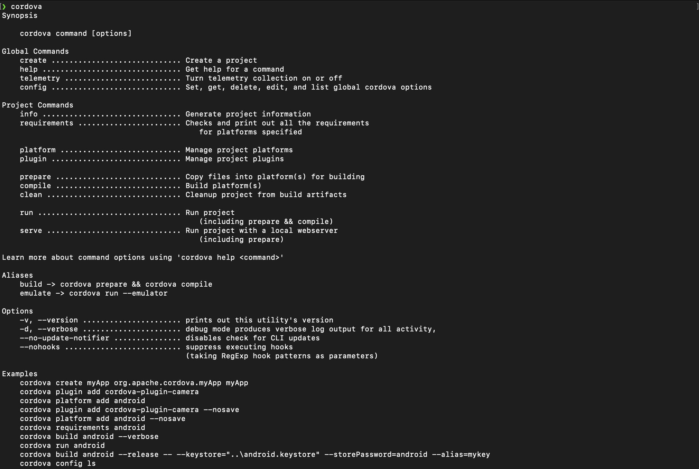

# Tutorial 16. Using Cordova

## 들어가면서

Cordova란 안드로이드 앱이나 iOS 앱을 만들때, java, kotlin, swift와 같은 네이티브 언어를 사용하지 않고, JS, HTML, CSS3를 이용하여 모바일 앱을 만드는 모바일 개발 프레임워크입니다. 이는 모든 레이아웃 렌더링이 네이티브 UI 프레임워크가 아닌 웹 뷰를 통해 수행되며, 네이티브 기기 API도 접근할수 있습니다. 이전까진 PhoneGap으로 불리다가 요즘엔 아파치 코도바가 되었습니다. Fiori 모바일 앱은 바로 Cordova 기반으로 수행됩니다. 일단 이 기술의 장점이라면, 웹뷰 기반이기 때문에 웹에서 사용되는 여러 테크닉이 앱으로 사용가능하다는 것입니다. 하지만, 네이티브로 작성된 코드보다 웹뷰로 먼저 변환을 거쳐야되기 때문에 퍼포먼스가 덜 나올 수 있습니다. 

  


## Hello world 띄우기

cordova를 이용해서 간단한 안드로이드 어플리케이션과 ios 어플리케이션을 만들어 보겠습니다. 먼저 아래 명령어를 실행해주세요

```text
npm i cordova -g 
```

위의 명령어가 정상적으로 수행된후에 terminal에 cordova라고 치면 아래와 같은 화면을 보실 수 있습니다.



cordova는 안드로이드나 ios 등 여러 플랫폼을 지원합니다. 또한, 플러그인을 사용하여 갤러리나 사운드 등 네이티브 코드로 작성된 부분을 불러와서 서비스에 적용하는 것도 가능합니다.

